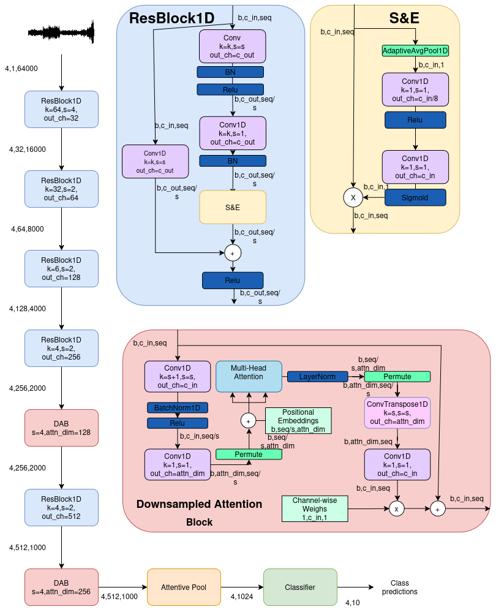

# Waveform Classification with Downsampled Attention

This repository implements an end-to-end 1D convolutional + self-attention architecture for audio classification on raw waveforms (4 s @ 16 kHz) along with the wav2vec2 and AST model finetuning.

Below is a high-level overview, followed by detailed instructions for setup, training, and inference. The accompanying architecture diagram shows the full data flow and dimensionality annotations.

---

## Table of Contents

1. [Project Structure](#project-structure)
2. [Requirements](#requirements)
3. [Getting Started](#getting-started)
   - [Installation](#installation)
   - [Data Preparation](#data-preparation)
4. [Architecture Details](#architecture-details)
5. [Training](#training)
6. [Inference](#inference)

---

## Architecture Diagram




## Project Structure

```

├── data/                   # (Optional) Placeholder for dataset scripts or links
├── models/                 # Model definitions 
├── scripts/                # Training & evaluation scripts (train.py, inference.py)
├── utils/                  # Utility functions (audio_preprocessing.py, augmentations.py)
├── model_diagram.png       # Architecture diagram
├── requirements.txt        # Python dependencies
└── README.md               # This file
```

---

## Requirements
Install dependencies via:

```bash
pip install -r requirements.txt
```

---

## Getting Started

### Installation

1. Clone this repository:

   ```bash
   git clone https://github.com/Toprak2/SANet.git
   cd SANet
   ```

2. (Optional) Create and activate a virtual environment:

   ```bash
   python3 -m venv venv
   source venv/bin/activate
   ```

3. Install requirements:

   ```bash
   pip install -r requirements.txt
   ```

### Data Preparation

- Model expects **4-second audio clips at 16 kHz** (i.e., 64,000 samples).
- Use `utils/audio_preprocessing.py` to load and preprocess waveforms:
  - Resample to 16 kHz
  - Convert stereo to mono
  - Crop or pad to exactly 64,000 samples

Will be added later
- For training, organize data into directories by class, e.g.:

```
    ├── data/                   # (Optional) Placeholder for dataset scripts or links
        ├── denoised_clips/
            ├── class1/
            │   ├── clip1.wav
            │   ├── clip2.wav
            │   └── ...
            ├── class2/
            │   ├── clip1.wav
            │   ├── clip2.wav
            │   └── ...
            └── ...
        ├── speech_segments/    # For training with dynamic data creation
            ├── class1/
            │   ├── clip1.wav
            │   ├── clip2.wav
            │   └── ...
            ├── class2/
            │   ├── clip1.wav
            │   ├── clip2.wav
            │   └── ...
            └── ...
```
---

## Architecture Details


Refer to `models/SqueezeAttendNet.py` for the full implementation. Key components:

- **ResBlock1D**: 1D residual block with optional Squeeze-and-Excitation (`SE1D`).

- **Squeeze-and-Excitation (SE1D)**: 
  1. Global average pooling to obtain channel-wise statistics.
  2. 1x1 convolutions for bottleneck that calculates attenntion weights.
  3. Scale input features by these weights.


- **DownsampledAttentionBlockDecoupled**: 
  1. Temporal downsampling via `Conv1d(stride=s)`
  2. Channel reduction via `Conv1d(1×1)`
  3. Add learnable positional embeddings
  4. Multi-Head Attention (on reduced sequence)
  5. Temporal upsampling via `ConvTranspose1d`
  6. Channel expansion via `Conv1d(1×1)`

- **AttentivePool**: Computes a self-attentive weighted mean and standard deviation over time.

- **AttentionEncoder**: 
  1. Stacked `ResBlock1D` stages to shrink 64,000→2,000 frames.
  2. First `DownsampledAttentionBlock` on 2,000 tokens (down→500→up).
  3. Additional `ResBlock1D` to shrink to 1,000 frames.
  4. Second `DownsampledAttentionBlock` on 1,000 tokens (down→250→up).
  5. `AttentivePool` to obtain a 1×1,024 embedding.
  6. Classifier head to produce logits for `N` classes.

Maximum intermediate sequence lengths and channel dimensions are annotated in the diagram.

---

## Training

Use `scripts/train.py` to train from scratch. Example usage:

Will be added later

---

## Inference

Use `scripts/inference.py` to perform inference on a list of audio files. Example:

Will be added later

---
